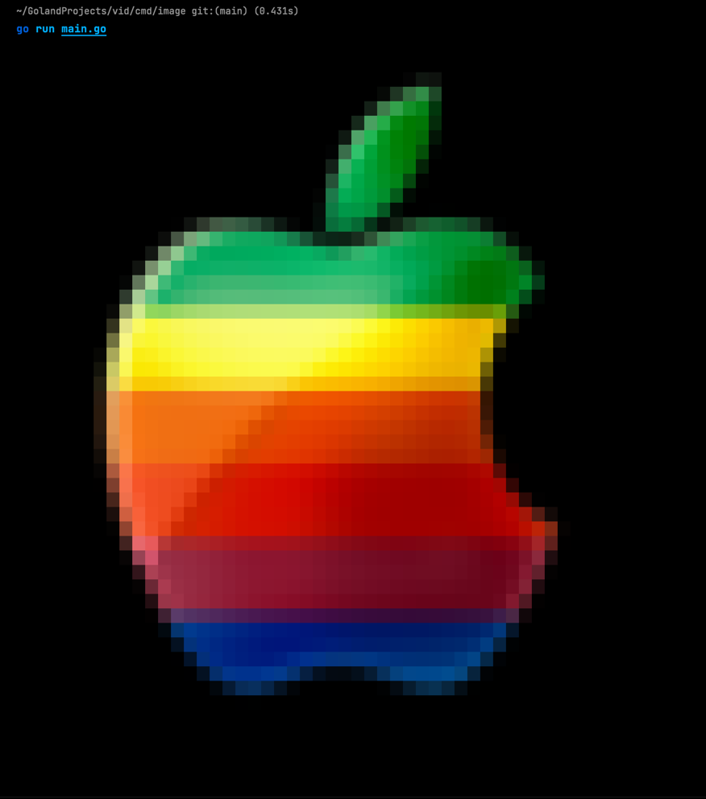

# VID
VID is a Go-based program that allows you to display images and play videos directly in your terminal using ANSI colors.

## Features
- Display images in the terminal using 256 colors or true colors (if supported)
- Play videos in the terminal with the original frame rate

## Examples

All working examples are available in cmd directory

- [video](https://github.com/kryptamine/vid/tree/main/cmd/video)
- [image](https://github.com/kryptamine/vid/tree/main/cmd/image)

## Image

```go
cwd, err := os.Getwd()
if err != nil {
    log.Fatal(err)
}

path := filepath.Join(cwd, "apple.png")

if err = vid.PrintImage(path, 60); err != nil {
    log.Fatal(err)
}
```



## Video

```go
cwd, err := os.Getwd()
if err != nil {
    log.Fatal(err)
}

path := filepath.Join(cwd, "clip.mp4")

if err = vid.PlayVideo(path, 130); err != nil {
    log.Fatal(err)
}
```